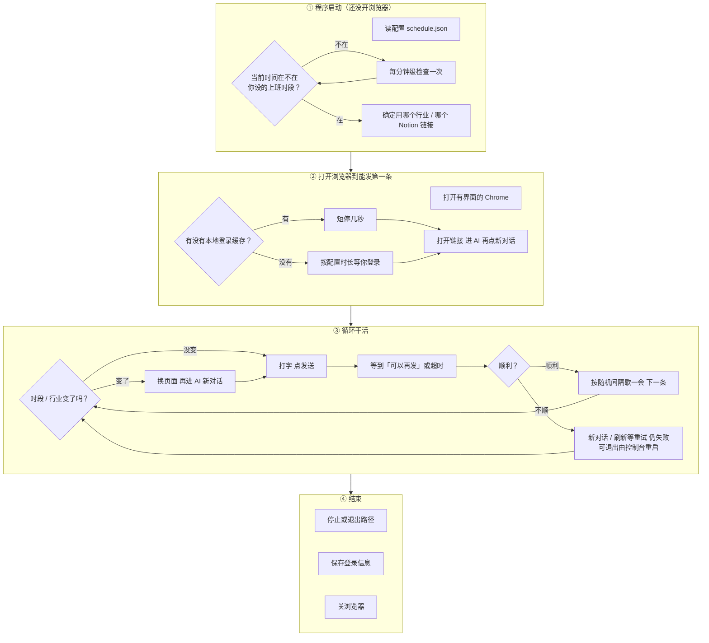
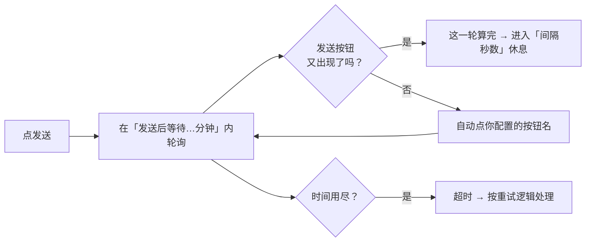

# Notion 自动化：浏览器（Playwright）在干什么？

用**大白话 + 流程图 + 参数说明**讲清：从启动到关浏览器，系统做了什么；**哪些数在网页上能改，哪些是程序写死的**。  
更细的字段名与代码位置见 [RUNTIME-TIMELINE.md](./RUNTIME-TIMELINE.md)。

---

## 先认两个词（汇报时够用）

| 说法 | 含义 |
|------|------|
| **网页控制台（Dashboard）** | 浏览器里打开的本项目配置页：改时间、任务、间隔、超时等，保存后写入 `schedule.json`。 |
| **内置参数** | 写在程序里，**Dashboard 没有输入框**；一般不用动，知道「存在」即可。 |
| **环境变量** | 在服务器 `.env` 或系统环境里配（例如 Notion API 密钥），**不在 Dashboard 表单里**。 |

**默认常用值**：网页上没填好时，很多项会用 **120 秒间隔、60 秒登录等待、5 分钟「等 AI 界面就绪」、重试 3 次** 这类默认（与 `schedule` 默认值或页面占位一致）。

---

## 一句话

程序会**自动打开一个真实的 Chrome 窗口**，按你在网页里设的**上班时段和任务**，在 Notion AI 里**打字 → 发送 → 等到能再发 → 歇一会儿 → 下一条**；你点停止或出严重故障时会**关浏览器**；控制台可按规则**自动再拉起**一轮。

---

## 整张「生命周期」鸟瞰图

**从上往下 = 时间先后**。

---

## ① 启动阶段：还没开浏览器

**做什么**：读配置 → 看表现在是否在「上班时段」内 → 不在就**反复等待**（大约每分钟醒来一次）→ 在了再决定用哪个行业、哪个链接。

| 参数 | 网页能改？ | 典型值 / 说明 |
|------|------------|----------------|
| **时间区间 + 绑定哪个行业** | ✅ 能（时间区间表格） | 几点到几点、对应哪个「行业」 |
| **行业列表里的 Notion 链接** | ✅ 能（编辑行业） | 每个行业一个门户 URL |
| **配置文件路径** | ⚠️ 一般不改 | 默认项目里 `schedule.json`；网页保存只写这个默认文件 |
| **等时段的检查间隔** | ❌ 内置 | **约 60 秒** 醒一次（程序写死） |

**给老板**：先对表，**到点再上班**；等待节奏是程序固定的「大约一分钟看一眼」。

---

## ② 打开浏览器到「能发第一条」

**做什么**：启动**看得见**的 Chrome → 加载/等待登录 → 打开当前行业的链接 → 点开 AI → 关掉可能出现的「个性化」弹窗 → 点**新对话**。

| 参数 | 网页能改？ | 典型值 / 说明 |
|------|------------|----------------|
| **首次无缓存时等你登录多久** | ✅ 能（「如果没有登录账号…」秒数） | 默认常填 **60 秒**，存成毫秒写入配置 |
| **已有登录缓存时的短停** | ❌ 内置 | **固定 5 秒**（给你顺手改账号用） |
| **是否用有头浏览器** | ❌ 内置 | **固定有界面**（非后台无头） |
| **点页面元素失败时重试几次** | ✅ 能（最大重试次数） | 默认 **3 次**（开 AI、新对话等步骤共用这类逻辑） |
| **等 AI 入口（头像）出现** | ❌ 内置 | 最多等 **60 秒** |
| **点完 AI 后小停顿** | ❌ 内置 | **1 秒** |
| **「个性化」弹窗检测时间** | ❌ 内置 | 短检测窗口 **3 秒** 量级 |
| **登录信息存哪** | ✅ 保存配置时网页会统一成固定文件名 | 常用 **`.notion-auth.json`**（与 Dashboard 启动子进程约定一致） |
| **单页默认点击超时** | ❌ 内置 | **30 秒**（Playwright 对单次定位的默认） |

**给老板**：**登录等多久**、**失败重试几次**在网页调；**5 秒短停、60 秒找入口**等是产品里写死的体验参数。

---

## ③ 循环干活（核心）

### 3.1 看表、换行业

| 参数 | 网页能改？ | 说明 |
|------|------------|------|
| **时段 / 行业** | ✅ | 同① |
| **换行业后页面加载再操作的小停顿** | ❌ 内置 | **0.5 秒** |
| **不在时段时在循环里等待** | ❌ 内置 | **60 秒** 再检查 |

### 3.2 发一条任务：打字 → 发送 → 等「可以再发」

| 参数 | 网页能改？ | 典型值 / 说明 |
|------|------------|----------------|
| **发送后最长等多久（界面就绪）** | ✅ 能（「发送后等待 AI 回复完成…」**分钟**） | 默认常 **5 分钟**；程序要求**至少 1 分钟** |
| **等的时候轮询多密** | ❌ 内置 | 大约 **每 1.5 秒** 看一眼页面 |
| **等待期间自动点的按钮名字** | ✅ 能（列表逐项添加） | 按按钮上**可见文字精确匹配** |
| **认为「可以收尾」后再扫几秒弹窗** | ❌ 内置 | 若配置了自动点按钮，成功后再扫 **5 秒**（防晚出来的按钮） |
| **输入+发送整步失败时重试次数** | ✅ 能（最大重试次数） | 默认 **3**；与②里同名配置是**同一套数** |
| **任务文案、每条跑几遍** | ✅ 能（行业里的任务链） | 内容 + 次数 |
| **每发几条就强制「新对话」** | ✅ 能（每 N 次区间） | 网页用最小～最大随机 |
| **每发几条尝试换一次模型** | ✅ 能（每 M 次区间） | 可为 0 表示不按次数换 |
| **某条任务指定用哪个模型** | ✅ 能（任务行可选填） | 填了则优先按指定模型 |
| **不要用的模型名单** | ✅ 能（黑名单多行文本） | 与菜单里名称一致 |

### 3.3 两条任务之间的「歇一会儿」

| 参数 | 网页能改？ | 典型值 / 说明 |
|------|------------|----------------|
| **发送成功后再隔多久发下一条** | ✅ 能（「每隔多少秒…」**最小～最大秒**） | 每次在区间内**随机**，默认界面常填 **120～120 秒**；避免固定节奏像机器人 |

### 3.4 本时段跑几轮就「下班等下个时段」

| 参数 | 网页能改？ | 说明 |
|------|------------|------|
| **时段内完整跑几轮任务链就停** | ✅ 能（0=不限制） | **仅任务链模式**会计数；队列模式不按这个数下班 |

### 3.5 不顺的时候（简化）

| 做法 | 参数来源 |
|------|----------|
| 新对话再发、刷新页面再试 | 内置流程；**刷新重开最多试 3 轮**（写死） |
| 仍失败 | 可**退出进程**让控制台决定是否自动重启；连续异常重启很多次可配邮件告警（**环境变量 SMTP**，非网页） |

### 3.6 可选：Notion 任务队列

| 参数 | 网页能改？ | 说明 |
|------|------------|------|
| **数据库地址、列名、状态文案、成功后更新或删除** | ✅ 能（队列整块表单） | 任务从表里拉 |
| **能不能真走队列** | 🌐 环境变量 + 网页 | 除网页填库地址外，还需 **`NOTION_API_KEY`**（环境变量）；否则仍走任务链 |
| **队列空了很久要执行的「指挥」页面和话术** | ✅ 能（Conductor 区） | 可选 |
| **指挥跑完后再等多久继续拉队列** | ❌ 内置 | **固定 5 分钟** |
| **没任务时多久再拉一次** | ❌ 内置 | **60 秒** |

**给老板**：日常最常调的是 **「等界面就绪几分钟」**、**「两条任务之间隔几秒」**、**「重试几次」**；**轮询多密、队列空窗 60 秒**等是内置节奏。

---

## ④ 结束：关浏览器

| 参数 | 网页能改？ | 说明 |
|------|------------|------|
| **关浏览器最长等多久** | ❌ 内置 | **10 秒** 超时兜底，避免卡死关不掉 |
| **谁触发停止** | ✅ 你点停止 | Unix 常见为发终止信号；Windows 另有 stdin 通知方式 |

**给老板**：停的时候会**尽量存登录信息**再关窗口。

---

## 补充：「发送后怎样算一轮结束」（带参数）

| 这一步 | 主要参数 |
|--------|----------|
| 总等待上限 | ✅ 网页：**等待 AI 回复完成（分钟）** → 程序里换算成毫秒 |
| 轮询频率 | ❌ 内置：约 **1.5 秒** 一轮 |
| 自动点按钮 | ✅ 网页：按钮名称列表 |
| 收尾后再扫弹窗 | ❌ 内置：**5 秒** |

**给老板的一句话**：结束条件是看 **「能不能再发下一条」的界面状态**，不是读 AI 内心；Notion 改版或卡顿可能**误判超时**，靠重试和人工看屏幕。

---

## 网页上没有、但运行要用的（环境变量，简表）

| 用途 | 典型变量 | 说明 |
|------|-----------|------|
| 从 Notion 拉队列任务 | `NOTION_API_KEY` | 不配则队列模式**启不起来**，会退回任务链 |
| 把运行结果写到 Notion 数据库当日志 | `NOTION_API_KEY` + `NOTION_RUN_LOG_DATABASE_URL` | 可选 |
| 连续自动重启告警邮件 | `NOTION_SMTP_*`、`NOTION_ALERT_TO` 等 | 可选 |

（程序加载时可能通过依赖库读到项目目录下的 `.env`，与是否从 Dashboard 启动有关。）

---

## 和 Dashboard 的关系（汇报一句）

- **网页**：改配置、点启动/停止、看日志。  
- **真正操控浏览器**：子进程里的自动化脚本；通过 Dashboard 启动时，**登录文件名**等与网页保存约定一致（常用 `.notion-auth.json`）。

---

## 想更细时看哪份文档？

| 需求 | 文档 |
|------|------|
| 逐步技术时间轴、Dashboard 控件 id 与 JSON 字段 | [RUNTIME-TIMELINE.md](./RUNTIME-TIMELINE.md) |

---

*本文与当前仓库 `src/index.ts`、`src/schedule.ts`、`src/server.ts` 主流程对齐；改代码时请同步更新表格中的内置数值。*
