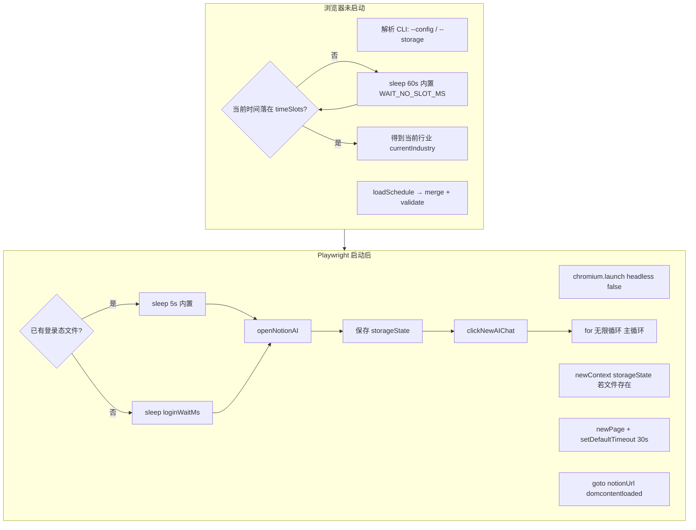

# notion-auto 运行时时间轴与参数说明

本文档按 **时间顺序** 说明何时执行何种动作，以及每项受哪些参数影响；并标明该参数是 **Dashboard 可配**、**仅 JSON/CLI**、**源码内置** 还是 **环境变量**。

**代码依据**：`src/index.ts`、`src/dashboard-runner.ts`、`src/server.ts`、`src/schedule.ts`。若改代码请同步更新本文档。

---

## 图例：参数「在哪改」

| 标记 | 含义 |
|------|------|
| **🖥️ Dashboard** | 在 `http://127.0.0.1:9000` 页面编辑后保存；写入 **`cwd/schedule.json`**（`GET/POST /api/schedule` 固定此路径）。 |
| **📄 schedule.json** | 手工编辑或与 Dashboard 同一文件；若用 **非默认** `--config` 指向别的文件，则与页面保存的文件 **可能不是同一份**。 |
| **⌨️ CLI** | 仅 **`npm run run`** 直接跑 `index.ts` 时：`--config`、`--storage`（见 `getConfigPathFromArgs`）。 |
| **🏃 Dashboard 启动** | 点击页面「启动」时子进程 **固定** 带 `--storage .notion-auth.json`（`dashboard-runner.ts`），且页面每次保存 schedule 时也会 **强制** `storagePath: '.notion-auth.json'`（`server.ts` 内 `collectScheduleFromForm`）。 |
| **⚙️ 内置** | 写死在 `src/**/*.ts`，无 UI、无 JSON 字段。 |
| **🌐 .env / 环境** | 运行前环境变量；`server.ts` 会 `import "dotenv/config"`。`index.ts` 文件顶部**没有**写 dotenv，但 **`notion-queue.ts` 与 `notion-run-log.ts` 均含 `import "dotenv/config"`**，且被 `index.ts` **静态 import**，故直接 `npm run run` 时通常仍会加载 **`cwd` 下 `.env`**（除非改打包/裁剪依赖）。 |

**补充**：当前 Dashboard 前端调用 `POST /api/start` 时 body 为 **`{}`**，**不传** `configPath`，故通过 UI 启动时 **`--config` 始终为默认 `schedule.json` 的绝对路径**。

---

## 总览：Mermaid 时间轴（自上而下 = 时间先后）

---

## 时间轴明细表（阶段 → 动作 → 参数 → 谁可配）

### 阶段 A：进程启动～打开浏览器之前

| # | 时机 | 执行的动作 | 影响的参数 / 常量 | 配置来源 |
|---|------|------------|-------------------|----------|
| A1 | 立刻 | 解析 `process.argv`：`--config`、`--storage` | `configPath`、`overrideStorage` | ⌨️ CLI；缺省 `--config` = `cwd/schedule.json` |
| A2 | A1 后 | `loadSchedule(configPath)` | 整份 `Schedule` | 📄 JSON；🖥️ Dashboard 保存的是默认路径下那份 |
| A3 | A2 后 | `getIndustryForNow`；若 null 则 `waitUntilInSlot` | `timeSlots`、`industries`（通过区间映射到行业） | 🖥️ / 📄 |
| A4 | 等待循环中 | 不在区间内每 60s 醒来一次 | `WAIT_NO_SLOT_MS = 60000` | ⚙️ 内置 `schedule.ts` |

### 阶段 B：首次打开浏览器与登录

| # | 时机 | 执行的动作 | 影响的参数 / 常量 | 配置来源 |
|---|------|------------|-------------------|----------|
| B1 | 已落入区间 | `chromium.launch({ headless: false })` | 无 | ⚙️ 内置，必有界面 |
| B2 | B1 后 | `newContext` 是否带 `storageState` | `storagePath`（可被 `--storage` 覆盖）；**Dashboard 路径下实际常用 `.notion-auth.json`** | 🏃 / ⌨️ / 📄（但被覆盖时注意） |
| B3 | B2 后 | `setDefaultTimeout(30000)` | 30000 ms | ⚙️ 内置 `index.ts` |
| B4 | B3 后 | `goto(currentIndustry.notionUrl)` | `industries[].notionUrl` | 🖥️ / 📄（行业编辑弹窗） |
| B5 | B4 后 | 等待登录 | 有 storage 文件：**5s**；否则 **`loginWaitMs`** | ⚙️ 5s 内置；`loginWaitMs` → 🖥️ 全局「登录等待」/ 📄 |
| B6 | B5 后 | `openNotionAI`：goto、等 AI 头像、点击、处理 Personalize | **`maxRetries`**；头像超时 **`AI_FACE_VISIBLE_TIMEOUT_MS` 60s**；**`MODAL_WAIT_MS` 1s**；**`PERSONALIZE_DIALOG_CHECK_MS` 3s** | `maxRetries` → 🖥️ / 📄；其余 ⚙️ `index.ts` + `selectors.ts` |
| B7 | B6 后 | 再次 `storageState` 写盘 | `storagePath` | 同 B2 |
| B8 | B7 后 | `clickNewAIChat` | **`maxRetries`** | 🖥️ / 📄 |

### 阶段 C：主循环（每一轮顶部）

| # | 时机 | 执行的动作 | 影响的参数 / 常量 | 配置来源 |
|---|------|------------|-------------------|----------|
| C1 | 每轮开始 | `getIndustryForNow`；若 null → sleep **60s** | `timeSlots`；sleep ⚙️ 内置 | 🖥️ / 📄 |
| C2 | 行业切换 | 新区行业：`goto`、等头像、点 AI、关弹窗、`clickNewAIChat`；重置计数并重抽 N/M | `notionUrl`；**`newChatEveryRunsMin/Max`**；**`modelSwitchIntervalMin/Max`**；`maxRetries`；60s/1s/3s 等同 B6 | 行业字段 → 🖥️ / 📄 |
| C3 | 同行业再入时段 | `leftCurrentSlot` 为 true 时重置 `chainRunsInSlot` | 逻辑依赖 `chainRunsPerSlot` 与区间 | 🖥️ / 📄 |
| C4 | 分支 | **`taskSource === notionQueue`** 且 **`isQueueAvailable(notionQueue)`** 为真 → 队列循环；否则走任务链 | 除 `notionQueue.databaseUrl` 外，还要求环境变量 **`NOTION_API_KEY` 非空**（见 `notion-queue.ts`）；否则视为队列不可用并回退任务链 | 🖥️ / 📄 + 🌐 |

### 阶段 D：任务链模式（单轮任务步骤）

| # | 时机 | 执行的动作 | 影响的参数 / 常量 | 配置来源 |
|---|------|------------|-------------------|----------|
| D1 | 每条 task 每 k 次 | 若满足 `sessionRuns % currentN === 0`（且 N>0、sessionRuns>0）→ New chat 并重抽 N/M | **`newChatEveryRunsMin/Max`**（随机成 currentN）；M 同理 | 🖥️ / 📄 |
| D2 | 发送前 | 指定模型或每 M 次轮换 | **`tasks[].model`**；**`modelSwitchIntervalMin/Max`**；**`modelBlacklist`** | 🖥️ / 📄 |
| D3 | 发送 | `tryTypeAndSend` / `typeAndSend` | **`maxRetries`**、**`autoClickDuringOutputWait`**、**`waitSubmitReadyMs`** | 🖥️ / 📄 |
| D4 | 发送失败恢复 | New chat 再发 → 仍失败则 `reopenNotionAndNewChat` 最多 **3** 次 | **`MAX_REOPEN_PER_ROUND`** | ⚙️ 内置 |
| D5 | 仍失败 | 先 **`flushRunLogToNotion`（success=false）**，再 **`saveProgress`**，再 **`closeBrowserAndExit(2)`** | 同 D6 的日志环境变量；**`EXIT_RECOVERY_RESTART`** | ⚙️ + 🌐；Dashboard 用 **`progress.completed`** 决定是否再 spawn |
| D6 | 每轮发送**判定结束后**（成功或失败） | **`flushRunLogToNotion`**（`isRunLogEnabled()` 为真才写 Notion） | **`runLogScreenshotOnSuccess`**（失败必截图/上传；成功是否截图看此项）；日志库：**`NOTION_API_KEY` + `NOTION_RUN_LOG_DATABASE_URL`**；**`Notion_AUTO_OWNER`** | 🖥️ 勾选；🌐 |
| D7 | 步间等待（任务链每步成功后；队列每单任务完成后） | `randomIntInclusive(intervalMinMs, intervalMaxMs)` | **`intervalMinMs` / `intervalMaxMs`**（由 Dashboard 的 **`intervalSecondsMin` / `intervalSecondsMax`** 换算，见下节） | 🖥️ / 📄 |

### 阶段 E：任务链「整轮」结束后

| # | 时机 | 执行的动作 | 影响的参数 / 常量 | 配置来源 |
|---|------|------------|-------------------|----------|
| E1 | 每跑完一轮完整 tasks | `chainRunsInSlot++` | **仅任务链分支**会执行到此处；**队列模式**在内层 `continue` 回到 `for(;;)` 顶部，**不会**递增 `chainRunsInSlot`，**`chainRunsPerSlot` 对队列行业不生效** | ⚙️ |
| E2 | 达上限 | 若 **`chainRunsPerSlot > 0`** 且 `chainRunsInSlot >= limit`，每分钟检查直到离开时段 | **`chainRunsPerSlot`** | 🖥️ / 📄 |
| E3 | 未限制或未满 | 立即再从头跑下一轮任务链 | — | — |

### 阶段 F：队列模式（概要）

| # | 时机 | 执行的动作 | 影响的参数 / 常量 | 配置来源 |
|---|------|------------|-------------------|----------|
| F1 | 取任务 / 打开页面 / 发 `help me run @…` | 与任务链共用：`maxRetries`、`waitSubmitReadyMs`、`modelBlacklist`、间隔随机等 | **`notionQueue`** 全部字段（库 URL、列名、状态文案、**Conductor** 等） | 🖥️ 队列卡片 / 📄 |
| F2 | 空队列达阈值 | 执行 Conductor：`goto` + 发送 `conductorPrompt` | **`conductorPageUrl`**、**`conductorPrompt`**、**`conductorEmptyQueueMinutes`** | 🖥️ / 📄 |
| F3 | Conductor 后 | **固定 sleep 5 分钟** | **`CONDUCTOR_POST_WAIT_MS`** | ⚙️ 内置 |
| F4 | 队列拉取/状态更新 | Notion API | **`NOTION_API_KEY`** 等 | 🌐 |

### 阶段 G：停止与进程外

| # | 时机 | 执行的动作 | 说明 | 配置来源 |
|---|------|------------|------|----------|
| G1 | 用户点停止 | Unix：`SIGTERM`；Windows：stdin `stop` | 关浏览器后退出 | Dashboard / 系统 |
| G2 | 子进程异常退出 | Dashboard `maybeAutoRestart`：读 **`progress.completed`**；可再 spawn；连续失败 **>5** 发邮件 | **`NOTION_SMTP_*`**、**`NOTION_ALERT_TO`** | 🌐；逻辑 ⚙️ `dashboard-runner` + `alert-email.ts` |
| G3 | 自动重启子进程 | 设置 **`NOTION_AUTO_RESUME=1`** | **schedule 主流程 `index.ts` 不读取**，无任务级续跑 | 🌐 由 runner 注入 |

---

## Dashboard 可配置项 ↔ `schedule.json` 字段（速查）

下列均在页面保存后进入 **默认** `schedule.json`（且 **`storagePath` 被写成 `.notion-auth.json`**）。

| 页面区域 | JSON 字段 |
|----------|-----------|
| 全局 | `intervalMinMs` / `intervalMaxMs`、`loginWaitMs`、`waitSubmitReadyMs`、`maxRetries`、`runLogScreenshotOnSuccess`、`autoClickDuringOutputWait`、`modelBlacklist` |
| 时间区间行 | `timeSlots[]`（`startHour`/`startMinute`/`endHour`/`endMinute`/`industryId`） |
| 行业列表 / 编辑弹窗 | `industries[]`：`id`、`notionUrl`、`taskSource`、`newChatEveryRunsMin/Max`、`modelSwitchIntervalMin/Max`、`chainRunsPerSlot`、`tasks[]`（`content`、`runCount`、`model`） |
| Notion 队列 | `notionQueue`（库 URL、列名、状态、**onSuccess**、**Conductor** 等） |

### Dashboard 表单控件 `id` ↔ `schedule.json`（最全对照）

下列 `id` 均定义在 **`src/server.ts`** 内嵌 HTML / `renderTimeSlots` / 行业弹窗脚本中。**`schedule.json` 里没有名为 `intervalSecondsMin` 的键**；落盘时由 `collectScheduleFromForm`（或等价收集逻辑）换算为毫秒字段。

| Dashboard 控件 `id`（或 DOM 约定） | 写入 JSON 的字段 | 换算 / 说明 |
|-----------------------------------|------------------|-------------|
| **`intervalSecondsMin`**、**`intervalSecondsMax`** | **`intervalMinMs`**、**`intervalMaxMs`** | 取两框秒数 `secMin`、`secMax`，令 `intervalMinMs = min(secMin,secMax)*1000`，`intervalMaxMs = max(secMin,secMax)*1000`；空/非法时默认按 120 秒。对应页面文案：「每隔多少秒 check 一次是否对话结束（区间，每次发送后随机）」。 |
| **`loginWaitSeconds`** | **`loginWaitMs`** | 秒 × 1000；默认 60。 |
| **`waitSubmitReadyMinutes`** | **`waitSubmitReadyMs`** | 分钟 × 60 × 1000；默认 5；校验至少 1 分钟。 |
| **`maxRetries`** | **`maxRetries`** | 正整数；默认 3。 |
| **`runLogScreenshotOnSuccess`** | **`runLogScreenshotOnSuccess`** | 勾选为 `true`。 |
| **`autoClickButtonsContainer`** 内各行输入 `.auto-click-row` | **`autoClickDuringOutputWait`** | 多行字符串数组，非空项才写入。 |
| **`modelBlacklistLines`** | **`modelBlacklist`** | 按行拆分、trim、去空行。 |
| **`timeSlotsContainer`** 内 `.slot-row` | **`timeSlots[]`** | 每行 `input/select` 用 **`data-key`**：`startHour`、`startMinute`、`endHour`、`endMinute`、`industryId`（无固定 `id`，按行顺序对应数组下标）。 |
| **`modalIndustryId`** | **`industries[].id`** | 编辑弹窗保存时写回当前行业。 |
| **`modalNotionUrl`** | **`industries[].notionUrl`** | |
| **`modalTaskSource`** | **`industries[].taskSource`** | `schedule` / `notionQueue`。 |
| **`modalNewChatEveryRunsMin`** / **`Max`** | **`newChatEveryRunsMin`** / **`Max`** | 保存时自动 min/max 规范化。 |
| **`modalModelSwitchIntervalMin`** / **`Max`** | **`modelSwitchIntervalMin`** / **`Max`** | 同上。 |
| **`modalChainRunsPerSlot`** | **`chainRunsPerSlot`** | |
| **`modalTasksContainer`** 内 `.task-row` | **`tasks[]`** | `data-key="content"`、`runCount`、`model`（可选）。 |
| **`queueDatabaseUrl`** | **`notionQueue.databaseUrl`** | 非空才组装 `notionQueue`。 |
| **`queueColumnActionName`** | **`columnActionName`** | |
| **`queueColumnFileUrl`** | **`columnFileUrl`** | |
| **`queueColumnModel`** | **`columnModel`**（可选） | 留空则不写入该键。 |
| **`queueColumnStatus`** | **`columnStatus`** | |
| **`queueColumnBatchPhase`** | **`columnBatchPhase`** | 保存为 trim 后的字符串；**全留空则为 `''`**（与占位符 `batch_phase` 不同，以 `server.ts` 收集逻辑为准）。 |
| **`queueStatusQueued`** / **`Done`** / **`Failed`** | **`statusQueued`** / **`statusDone`** / **`statusFailed`** | |
| **`queueOnSuccess`**（radio） | **`onSuccess`** | `update` / `delete`。 |
| **`queueConductorPageUrl`**、**`queueConductorPrompt`**、**`queueConductorEmptyMinutes`** | **`conductorPageUrl`**、**`conductorPrompt`**、**`conductorEmptyQueueMinutes`** | 仅当 URL 与 Prompt 均非空时写入 Conductor 相关字段；分钟数默认 30。 |

**保存时写死**：`collectScheduleFromForm` 返回对象中 **`storagePath` 恒为 `'.notion-auth.json'`**，与页面上是否曾显示该字段无关。

**其它工程文件**：`src/dashboard-params.ts` 内有旧式 **`intervalSeconds`**（单值）等，供另一套参数导出使用；**当前 Dashboard 主 UI 与 `index.ts` 主流程以 `server.ts` 内嵌页 + `schedule.json` 的 `intervalMinMs`/`intervalMaxMs` 为准**。

**不在 Dashboard 的 schedule 相关项**：`--config` 其它路径（UI 未传）、**内置常量**（上表 ⚙️）、**队列空窗 60s / 等区间 60s / 5s 有登录态 / Conductor 后 5min** 等。

---

## 附录：进程入口与其它说明

| 方式 | 命令 | 说明 |
|------|------|------|
| Dashboard | `npm run dashboard` → `tsx src/server.ts` | `127.0.0.1:9000`；启动脚本为子进程 `npx tsx src/index.ts --config … --storage .notion-auth.json` |
| 直接运行 | `npm run run` → `tsx src/index.ts` | 可使用 `--config` / `--storage`；无 Dashboard 包装 |

**旧版 CLI**：`src/config.ts` 的 `--total`、`--resume` 等 **未被** 当前 `index.ts` 的 `main()` 调用，对 schedule 模式 **无效**。

---

## 与代码不一致或易混淆处（审核结论）

1. **`NOTION_AUTO_RESUME`**：Dashboard 自动重启会设置，但 **`main()` 不读**，无「从 progress 续跑任务链」逻辑。  
2. **`completed: true`**：**`index.ts` 从未写入**；仅 Dashboard 用其抑制自动重启。  
3. **双文件**：页面只编辑默认 `schedule.json`；若 CLI 使用另一 `--config`，易与 UI 不同步。  
4. **`index.ts --help`** 中关于 `NOTION_AUTO_RESUME` 的表述易与真实行为不符。  
5. **`index.ts` 与 dotenv（已改前文图例）**：旧版文档写「主脚本不加载 `.env`」**不严谨**——依赖链上的 **`notion-queue.ts` / `notion-run-log.ts`** 会在加载时执行 **`import "dotenv/config"`**。  
6. **源码注释笔误**：`index.ts` 中 `leftCurrentSlot` 一行注释写「跑满 **N** 轮」，实际逻辑是 **`chainRunsPerSlot` 跑满**；本文 **C3** 按代码语义描述，与注释不一致时以代码为准。

### 此前版本文档中的硬伤（已在正文表中修正）

| 问题 | 代码事实 |
|------|----------|
| D6 写「成功后」才写运行日志 | **失败**时在 `exit(2)` 前也会 **`flushRunLogToNotion(..., false, ...)`**。 |
| D5 只提 `saveProgress` + 退出 | 顺序是 **先 flush 日志，再 `saveProgress`，再 `closeBrowserAndExit(2)`**。 |
| C4 未写队列准入条件 | 除 `taskSource` 与 `notionQueue` 外，必须 **`NOTION_API_KEY`** 且 **`databaseUrl`**，否则 **`isQueueAvailable` 为 false**，走任务链。 |
| E1 未区分队列 | **`chainRunsInSlot++` 仅出现在任务链路径末尾**；队列模式 **`continue`** 跳过，**`chainRunsPerSlot` 对队列无效果**。 |
| Mermaid 省略 | `openNotionAI` 内部会 **再次 `goto(notionUrl)`**（与 B4 的 goto 重复一次），图为简略未画。 |

---

## 维护

修改 `main()`、Dashboard 表单、`dashboard-runner` 或 schedule 校验后，请同步更新 **图例**、**Mermaid 图** 与 **明细表**。
